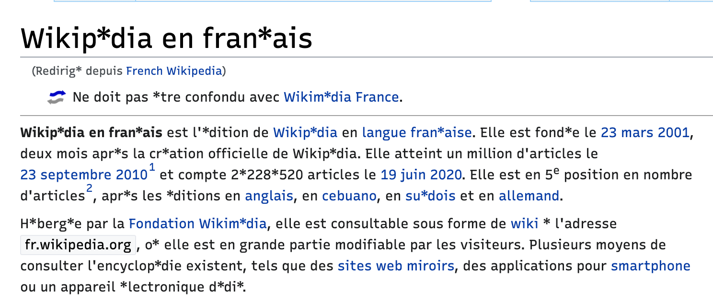

# An Intro to FontTools

This post is an introduction to FontTools and modern font development more generally.

It is written from the perspective of a beginner/intermediate font designer & developer (me, Stephen Nixon / [@ArrowType](https://instagram.com/arrowtype)), intended as an approachable introduction to font development for designers or developers hoping to better understand some common processes & tools of font development.

Basically, this is an attempt to write & present the guide I wish I had three years ago, when I first encountered font development as a student at KABK TypeMedia. Some of it requires knowledge of navigating in a terminal and using Python, but a lot of it is written in hopes of being accessible to almost anyone.

It is opinionated, limited to my current perspective, and possibly not 100% accurate. For this reason, I am presenting this at the [Typographics 2020 TypeLab](https://2020.typographics.com/typelab/) in hopes that more-experienced font developers might participate in conversation that can help me to correct any inaccuracies and improve this guide. Additionally, if you spot something here that is inaccurate or if you have questions, please file an [issue](https://github.com/arrowtype/fonttools-intro/issues) or [pull request](https://github.com/arrowtype/fonttools-intro/pulls) in this repo to help myself & others learn!

## Basic things to know about fonts & font development

Digital fonts, like any other digital media, are made up of data. Each glyph in a font is drawn from a collection of points on a coordinate grid, in scaleable curves called *Bézier* curves. Fonts have to map these drawings to [Unicode](https://en.wikipedia.org/wiki/List_of_Unicode_characters), so that the right glyph can display for each character in text on any computer. Fonts include a lot of other data: kerning, layout logic (e.g. for the place of accents, for stylistic sets, contextual alternates, etc), metrics for layout, family & style names for various software, license information, version numbers, and much more.

While some fonts are standalone, single-style things, many fonts are members of large font families (AKA typefaces) which have different but related styles.

Modern fonts follow the [OpenType specification](https://docs.microsoft.com/en-us/typography/opentype/spec/), which describes the data *tables* that all of this information is stored in. The OpenType spec is somewhat similar to the HTML, CSS, and JS specs that describe the “ground rules” that make up the modern web.

For end-users, the most common font file types are `TTF` and `OTF` (typically the latter are more specifically `CFF` or `CFF2` files). The biggest technical difference between `TTF` and `CFF` files is how they store glyph shapes. `CFF` fonts store glyphs as *Cubic* Bézier curves, which are similar to curves you may be familiar with from the pen tools of apps like Adobe Illustrator, Sketch, & Figma – these curves have two “offcurve points” between all main “oncurve” points. `TTF` fonts use *Quadratic* Bézier curves, which can have one to many offcurve points between oncurve points. The two formats also take different approaches to data compression and hinting, and have pros & cons in different software. However, both types are OpenType fonts, and both share many of the same data tables.

`TTF` and `OTF` files are called *binaries* because they are made up of code that is not human-readable. Font designers don’t (typically) work directly in binaries. Instead, they work in source files which are often `.glyphs` (for [GlyphsApp](https://glyphsapp.com/)) or `.ufo` (the open-source format Unified Font Object, which is most commonly edited in [RoboFont](https://robofont.com/)). While `.glyphs` files can include multiple font sources to make up a single font family, `.ufo` sources are individual files, and `.designspace` files describe how multiple UFOs make up a given font family.

From these sources, binary files like OTF & TTF can be exported/built. For fonts on the web, these OTF/TTF files can then be further compressed into web-specific formats (the standard of which is now `woff2`).

At core, a lot of what FontTools does is to allow people to read & manipulate these different font filetypes with Python. In turn, this allows scripts & software that can create, modify, and build fonts.

## What is FontTools?

From the [FontTools repo](https://github.com/fonttools/fonttools/):

> fontTools is a library for manipulating fonts, written in Python.

For my purposes, FontTools is a set of code-based tools to read & manipulate:
- OTF & TTF font binaries
- UFO & Designspace font sources
- More font formats that I haven’t yet needed to work with

Rather than being one big thing, FontTools is a *collection* of [many tools](https://github.com/fonttools/fonttools/tree/master/Lib/fontTools), including:

- **cu2qu** for conversion between cubic & quadratic Bézier curves
- **designspaceLib** for reading & writing Designspace files
- **feaLib** for reading & writing OpenType features (e.g. accent placement, contextual glyph selection)
- **merge** to merge multiple font files into together
- **pens** that can read & draw different kinds of Bézier paths
- **subset** which can make font files smaller by eliminating (or subsetting) certain glyphs
- **ttLib** converts TrueType fonts to/from Python objects, and Python objects to/from TTX. This includes **TTFont** which can be used to read/edit data in font binaries
- **ttx** is a command-line tool to convert font binaries to/from human-readable [XML](https://developer.mozilla.org/en-US/docs/Web/XML/XML_introduction), allowing the data to be inspected or easily changed
- **ufoLib** allows the reading & writing of UFO files & the data within
- **varLib** allows the building of [variable fonts](https://variablefonts.io/), as well as the instancing of variable fonts (trimming the amount of stylistic range in a variable font, either to make small variable fonts or single static fonts).

There are more tools than these, but I am still learning about them.

To learn more about FontTools, you can [read the docs](https://fonttools.readthedocs.io/), or browse the [source code](https://github.com/fonttools/fonttools) (which includes documentation inside of many functions).

### How is FontTools different from / related to FontParts? FontMake? FontBakery? AFDKO?

Parts of FontTools act as a major component of many other font-related tools.

As I was starting into font development, it was confusing to me that there were several tools with similar names and (sometimes) interdependencies. To be honest, I’m still learning things about how various Python libraries relate & interact, and others could speak in much more depth about how these things use FontTools. Here are four major tools that use FontTools in various ways:

**[FontParts](https://fontparts.robotools.dev/en/stable/)**

- Gives a logical structure to fonts, font info, glyphs, and contours (and [more](https://fontparts.robotools.dev/en/stable/objectref/objects/index.html)), and includes methods to manipulate these different objects to allow scripting workflows in type design.
- Can be used as a part of script tools in RoboFont (but is intended to be usable in any font editor)
- Can also be used in external Python scripts or via terminal commands to edit UFO files without requiring RoboFont.
- Uses FontTools

**[FontMake](https://github.com/googlefonts/fontmake/)**

- A command-line tool to build binary fonts from sources
- Can build `UFOs → OTF/TTF` or `Glyphs → UFOs → OTF/TTF`
  - Uses [glyphsLib](https://github.com/googlefonts/glyphsLib) to go from Glyphs files to UFOs + Designspace files
  - If building from Cubic (CFF) curves to Quadratic (TTF) curves, uses cu2qu for conversion
  - Uses FontTools to build output binaries
- Can also be used as a module in Python scripts for more-custom build setups
- Primarily sponsored & maintained by Google Fonts
- Uses FontTools to build prepared UFOs into OTFs & TTFs

**[FontBakery](https://github.com/googlefonts/fontbakery/)**

- A command-line tool to run quality-assurance checks on fonts in various formats: UFO, TTF, OTF
- The checks that run test for many things that can cause fonts to not work as expected. Examples:
  - Data tables that are missing or misformed
  - Font name entries that don’t match expectations (e.g. they are too long, they are different within the same font family, etc)
  - Font metrics that mismatch within a family
  - Variable axes with ranges that don’t conform to the OpenType spec
- There are some “universal” checks useful for almost any font, and there are checks specific to the expectations of individual font libraries such as Google Fonts or Adobe Fonts
- Uses FontTools to “inspect” font data in order to run checks

**[AFDKO](https://github.com/adobe-type-tools/afdko/) (Adobe Font Development Kit for OpenType)**

- Somewhat similar functionality to FontMake, but primarily sponsored & maintained by Adobe
- My favorite part: `otf2otc`, which makes OTC files out of a collection of OTF files ([example](https://github.com/arrowtype/recursive/blob/2c1c9d58e2130851cd6cee804d71ccce73b75805/src/build-scripts/make-release/make-otc-files.sh))
- Includes tools for proofing and validating font files
- Has some advantages for building CFF fonts, like better CFF hinting & compression
- Uses FontTools to build prepared UFOs into OTFs & TTFs
- (Note: I don’t have as much experience with the AFDKO, so it is something I still need to learn more deeply. My apologies if the summary above isn’t perfect, but I welcome contributions.)

## Using FontTools for common font development tasks

**Cloning the repo**

To work directly with these examples, you should have [Git set up on your computer](https://help.github.com/en/github/getting-started-with-github/set-up-git).

To try these examples, clone this repo onto your computer!

```bash
# first, use `cd` to navigate the parent directory of where you want to work
git clone https://github.com/arrowtype/fonttools-intro.git
cd fonttools-intro # change directory into the cloned repo
```

**Setup**

1. To use FontTools, you first have to [download Python](http://python.org/download/) and install it if you haven’t already.

2. To try the examples in this repo, set up a virtual environment. Navigate to this directory in a command line, then make a venv and activate it:

```bash
python3 -m venv venv      # creates a virtual environment in directory `venv`
source venv/bin/activate  # activates virtual environment
```

If you close and come back to the folder later, use `source venv/bin/activate` again.

3. Install FontTools with Pip:

```bash
pip install fonttools
```


### TTX

Just like web browsers have Developer Tools which allow you to “Inspect” the HTML, CSS, JS, and files that make up webpages, TTX allows you to convert binary fonts into human-readable XML so that you can inspect data.

A common way to use TTX is to simply build a XML from an OTF or TTF file (replacing the all-caps placeholders with an actual font filepath):

```bash
ttx examples/Recursive_VF_1.077.ttf # makes XML file examples/Recursive_VF_1.077.ttx
```

However, often, you only want to look at a single table of a font such as the `name` table. You also usually don’t need to save a new TTX file, but just want to check values. So, my favorite recipe is this:

```bash
ttx -t name -o- examples/Recursive_VF_1.077.ttf # just shows the name table
```

In that command, `-t name` specifies that only the name table should be converted to XML, and `-o-` specifies that the “output” should be nothing (and so, rather than a file, the XML is simply printed directly in the terminal). I remember this because `-o-` looks a bit like an emoticon owl.

TTX will also compile a TTX file back into a binary font file. So, it is possible to TTX a font, make changes in the `.ttx` file, and then run TTX to save those edits into a working font.

```bash
ttx examples/Recursive_VF_1.077.ttf # outputs examples/Recursive_VF_1.077.ttx
# you can make some manual edits, e.g. changing name table entries
ttx examples/Recursive_VF_1.077.ttx # outputs examples/Recursive_VF_1.077#1.ttf
```

However, editing font files by editing the TTX is relatively slow and hard to repeat. For example, if you are processing a folder containing many static fonts within a type family, it will take time to covert from OTF/TTF to TTX, time to make the changes (even if you write a script to do so), and time to convert back to OTF/TTF. It will probably take a few minutes, and chances are, you may have to run the process many times while developing it, making it painfully slow. So, TTX is really best used as a font inspector. 

To efficiently edit font data, it is much more useful to reach for `ttFont`.

## TTFont

`ttFont` makes it possible to manipulate font binaries “directly” with Python (some conversion is involved to/from font data & Python objects, but it is very fast). The basic use of ttFont is in a Python script:

1. Import ttFont with `from fontTools.ttLib import TTFont`
2. Use it to open a font path `font = TTFont(fontPath)`
3. Access font tables in the format of `font['head']`, and entries in the format of `font['head'].fontRevision` – refer to [the OpenType spec](https://docs.microsoft.com/en-us/typography/opentype/spec/otff#font-tables) for details on each table
4. After updating data, save with `font.save(fontPath)`

### A basic example/template using TTFont

A basic example of a Python script using TTFont is in `examples/00-ttfont-template.py`. To run it, make sure you navigate to this folder in a terminal, have your venv activated, and have FontTools installed, then run:

```bash
python examples/00-ttfont-template.py examples/Recursive_VF_1.077.ttf
```

It should output `→ name1 is 'Recursive Sans Linear Light'`.

### Editing Font Names with TTFont

It’s worth noting that font files have many different entries for names for various purposes, listed under [“Name IDs”](https://docs.microsoft.com/en-us/typography/opentype/spec/name#name-ids). This may be surprising at first, but there are a lot of names needed for a usable font!

A common need might be updating the family name of a font.

One method is provided at `examples/01-ttfont-name-updates.py`. This includes:

- code comments to detail each line
- helper functions to make it simpler to get & set names

Run it from the directory above with the following command, include 1) a font path, and 2) a new family name:

```bash
python examples/01-ttfont-name-updates.py examples/Recursive_VF_1.077.ttf "New Name"
```

(The above command will output `NewName_VF_1.053.ttf`)

Notice how *stupidly fast* it is to run that change. It takes a little longer to write the script, but with it, you can process many files, many times, in minimal time.

## Subsetting a Font

Running the following in the command line will subset Recursive to have a basic Latin character set:

```bash
fontPath="examples/Recursive_VF_1.077.ttf"
pyftsubset $fontPath --flavor="woff2" --output-file="${fontPath/'.ttf'/--subset-GF_latin_basic.woff2}" --unicodes="U+0000-00FF,U+0131,U+0152-0153,U+02BB-02BC,U+02C6,U+02DA,U+02DC,U+2000-206F,U+2074,U+20AC,U+2122,U+2191,U+2193,U+2212,U+2215,U+FEFF,U+FFFD"
```

This can be further configured with [other unicodes & unicode ranges](https://en.wikipedia.org/wiki/List_of_Unicode_characters).

As with many command line tools, you can learn how more about using it by running `pyftsubset --help`.

## Instancing a Variable Font

You can use the Instancer to make smaller instances of a variable font, “pinning” axes to a single value or limiting them to given ranges. You can run it as a Python module or from the command line. (One current limitation: axis ranges must include their default position, such as Recursive’s `wght` default of `300`.) For example:

```bash
fonttools varLib.instancer examples/Recursive_VF_1.077.ttf CASL=1 wght=300:850 # outputs examples/Recursive_VF_1.077-partial.ttf
```

The docs in [instancer.py](https://github.com/fonttools/fonttools/blob/master/Lib/fontTools/varLib/instancer.py) are very good.

## Putting several techniques together

The script `examples/02-make-trial-font.py` puts several of these techniques together to make a “trial” font, keeping characters for specified unicodes while hiding the rest with a “replacer” glyph.

```bash
python examples/02-make-trial-font.py examples/Recursive_VF_1.077.ttf -r "asterisk"
```

This script also makes use of Python `argparse` to allow multiple arguments to be passed in from the command line. Run `python examples/02-make-trial-font.py --help` to see more options for the script (or look at the code itself).

The result of the command above is a font that subsets out non-basic Latin characters, and updates their previous unicodes to point to the asterisk glyph. In text, the result looks like this:



(If you wish to run this script on a folder of fonts, one method is shown in [this GitHub Gist](https://gist.github.com/arrowtype/db9562858a56ab45010e390c3f788b84).)

### Other useful things to know about TTFont

You can set data into almost any table & entry. For example, if the TTX for the `head` table includes `<fontRevision value="1.053"/>`, you can edit that with:

```python
font['head'].fontRevision = 1.054
```

You can delete a whole table like this:

```python
del font["mvar"]
```

There’s a lot more to it, much of which I still need to learn. As with many things in Python, [the `help()` function](https://docs.python.org/3/library/functions.html#help) is your best friend! A good start: on the command line, run `python3`, import TTFont, and then run `help(TTFont)`. (You can exit the help view by hitting **q**, and exit out of the Python mode by hitting **control d**.)

```bash
$ python3
>>> from fontTools.ttLib import TTFont
>>> help(TTFont)
Help on class TTFont in module fontTools.ttLib.ttFont # etc etc
```

------------------------------------------------------------------

## Also useful

- https://github.com/google/woff2 to compress/decompress woff2 files

## Other learning resources for FontTools

- [The FontTools docs](https://fonttools.readthedocs.io/en/latest/index.html)
- [A very good TTFont tutorial by Lynne Yun](https://github.com/lynneyun/Tutorials/blob/6cabd407054431559b30d66d9b664462bb1d58b7/FontTools%20%26%20DrawBot/Navigating%20TTFs%20with%20fontTools.ipynb)

## Fonts used

This uses Recursive VF 1.053, available as an OFL on GitHub ([permalink](https://github.com/arrowtype/recursive/blob/006828dd941878bf0819a97c9d6286f24972bb16/fonts_1.031/Variable_TTF/Recursive_VF_1.031.ttf)).

The slide presentation also uses Name Sans, [available from Future Fonts](https://www.futurefonts.xyz/arrowtype/name-sans).
